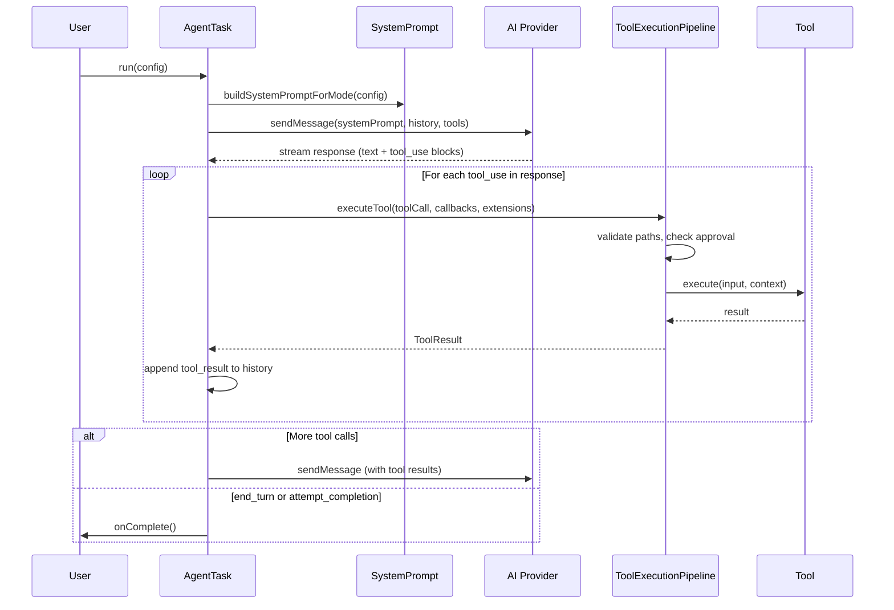

# Agent Loop

The agent loop is the heartbeat of Obsilo. It turns a single user message into a multi-step, tool-using conversation that runs until the task is complete or a safety limit is hit. The implementation lives in `src/core/AgentTask.ts`.

## AgentTask Construction

`AgentTask` accepts 12 constructor parameters that control loop behavior:

| Parameter | Default | Purpose |
|-----------|---------|---------|
| `api` | -- | AI provider handler (Anthropic/OpenAI) |
| `toolRegistry` | -- | Central tool registry instance |
| `taskCallbacks` | -- | UI callbacks (onText, onToolStart, onComplete, ...) |
| `modeService` | -- | Mode switching and web-tools toggle |
| `consecutiveMistakeLimit` | `0` (disabled) | Abort after N consecutive tool errors |
| `rateLimitMs` | `0` (disabled) | Minimum ms between iterations |
| `condensingEnabled` | `true` | Automatic context condensing |
| `condensingThreshold` | `70` | Condense when tokens exceed this % of context window |
| `powerSteeringFrequency` | `0` (disabled) | Inject mode reminder every N iterations |
| `maxIterations` | `25` | Hard cap on loop iterations |
| `depth` | `0` | Current sub-agent nesting level |
| `maxSubtaskDepth` | `2` | Maximum nesting depth for `new_task` |

The `run()` method accepts an `AgentTaskRunConfig` with the user message, task ID, initial mode, conversation history, and optional context (rules, skills, memory, MCP client).

## Message Flow

## Iteration Mechanics

Each iteration of the loop:

1. **Fires `onIterationStart(n)`** -- the UI uses this to show progress.
2. **Assembles the system prompt** -- cached and rebuilt only when the mode changes or tool availability shifts (e.g., `webTools.enabled` toggle).
3. **Calls the AI provider** -- streaming text chunks via `onText()` and thinking via `onThinking()`.
4. **Collects tool calls** -- the response may contain zero or more `tool_use` blocks.
5. **Executes tools** -- read-only tools from the `PARALLEL_SAFE` set run concurrently via `Promise.all()`. Write tools and control-flow tools always run sequentially.
6. **Appends results** -- tool results go back into the conversation history for the next iteration.

::: info Parallel Execution
The `PARALLEL_SAFE` set includes: `read_file`, `list_files`, `search_files`, `get_frontmatter`, `get_linked_notes`, `search_by_tag`, `get_vault_stats`, `get_daily_note`, `web_fetch`, `web_search`, `semantic_search`, `query_base`, `open_note`. These are pure reads with no side effects -- safe to run concurrently.
:::

## Safety Mechanisms

### Consecutive Mistake Tracking

Every tool error increments a counter. A successful tool call resets it to zero. When the counter reaches `consecutiveMistakeLimit`, the loop aborts with a clear error. This prevents the agent from burning tokens on a broken approach.

### Iteration Limits

Two thresholds protect against runaway loops:

- **Soft limit** (`maxIterations * 0.6`): the agent receives a warning that it is approaching the limit. This gives it a chance to wrap up with `attempt_completion`.
- **Hard limit** (`maxIterations`, default 25): the loop terminates unconditionally.

### Tool Repetition Detection

`ToolRepetitionDetector` (`src/core/tool-execution/ToolRepetitionDetector.ts`) maintains a sliding window of 15 recent calls and blocks:

- **Exact repetition**: identical tool + input appearing 3+ times in the window.
- **Fuzzy search dedup**: semantically similar search queries (Jaccard similarity > 0.5) for search tools appearing 3+ times.

Blocked calls return a recoverable error -- the agent can try a different approach.

### Rate Limiting

When `rateLimitMs > 0`, each iteration sleeps for at least that duration. This is a simple throttle for API cost control during development.

## Context Condensing

When `condensingEnabled` is true and the estimated token count exceeds `condensingThreshold` percent of the model's context window, the agent triggers condensing:

1. **Pre-compaction flush** -- `onPreCompactionFlush` fires so important facts can be persisted to memory before history is trimmed.
2. **Summarization** -- the conversation history is summarized into a compact representation.
3. **History replacement** -- the original messages are replaced with the condensed version.
4. **`onContextCondensed` callback** -- reports token counts before and after.

::: tip Emergency Condensing
When the API returns a 400-class error indicating context overflow, the agent triggers emergency condensing regardless of the threshold setting. The condensing threshold then resets to 80% to prevent thrashing. This is the "never crash on long conversations" safety net.
:::

## Power Steering

During long agentic loops, models tend to drift from their assigned role. When `powerSteeringFrequency > 0`, the loop injects a synthetic user message every N iterations reminding the model of its active mode, role definition, and any active skill names. This is a lightweight steering mechanism -- no extra API call, just an additional message in the history.

## Multi-Agent: Sub-Task Spawning

The `new_task` tool spawns a child `AgentTask` with:

- A fresh conversation history (no parent context leakage).
- Its own mode (can differ from the parent).
- Depth incremented by 1 (`depth + 1`).
- Condensing disabled (children run lean).
- Power steering disabled.
- Parent's approval callback forwarded (so child write ops still get human approval).

::: details Depth Guard
Children at `maxSubtaskDepth` (default 2) receive `spawnSubtask = undefined`, which means the `new_task` tool is unavailable to them. This prevents unbounded recursive spawning. Token usage from children is accumulated into the parent's totals for accurate billing display.
:::

## Episode Data

When the task completes, `onEpisodeData` fires with the tool sequence and a structured tool ledger from `ToolRepetitionDetector`. This feeds the episodic memory system (ADR-018) so the agent can learn from past task patterns.
