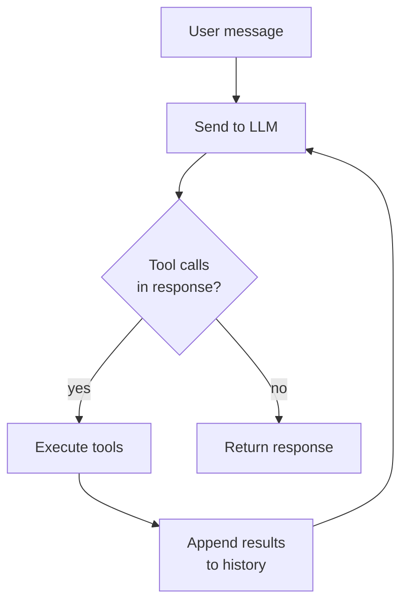

# The agent loop

A chatbot responds once. An agent loops. That distinction is the single most important thing to understand about Obsilo.

When you send a message, Obsilo passes it to the language model along with a system prompt and tool definitions. The model responds with text, tool calls, or both. If there are tool calls, Obsilo executes them, appends the results to the conversation history, and sends everything back to the model. This repeats until the model responds with only text, calls `attempt_completion`, or a safety limit stops the loop.

The entire loop lives in one file: `src/core/AgentTask.ts`.

## The loop, visually

That's it. Everything else on this page is about controlling, protecting, and extending this loop.

## What happens at each step

The loop starts by assembling a system prompt. This prompt is built from 16 modular sections: mode definition, available tools, active rules, loaded skills, memory context, and more. The system prompt is cached and only rebuilt when something changes (a mode switch, a tool availability toggle).

The assembled prompt and conversation history go to the AI provider. Obsilo streams the response, firing `onText()` for each text chunk and collecting any `tool_use` blocks.

If the response contains tool calls, each one goes through `ToolExecutionPipeline` in `src/core/tool-execution/ToolExecutionPipeline.ts`. The pipeline validates paths, checks approval requirements, creates checkpoints before write operations, executes the tool, and logs the result. No tool bypasses this pipeline. Not even MCP tools from external servers.

Read-only tools from the parallel-safe set (`read_file`, `search_files`, `semantic_search`, etc.) run concurrently via `Promise.all()`. Write tools and control-flow tools run one at a time.

The tool results go back into the conversation history as structured result blocks. Then the loop sends the updated history to the model for the next iteration.

When the model responds with only text and no tool calls, or when it calls `attempt_completion`, the loop ends and the response goes back to the UI.

## AgentTask constructor

`AgentTask` takes 12 parameters that control loop behavior.

| Parameter | Default | What it does |
|-----------|---------|-------------|
| `api` | required | AI provider handler (Anthropic or OpenAI) |
| `toolRegistry` | required | Central tool registry |
| `taskCallbacks` | required | UI callbacks for text, tool events, completion |
| `modeService` | optional | Mode switching and web-tools toggle |
| `consecutiveMistakeLimit` | `0` (off) | Abort after N consecutive tool errors |
| `rateLimitMs` | `0` (off) | Minimum milliseconds between iterations |
| `condensingEnabled` | `true` | Automatic context condensing |
| `condensingThreshold` | `70` | Condense when tokens exceed this % of context window |
| `powerSteeringFrequency` | `0` (off) | Re-inject mode instructions every N iterations |
| `maxIterations` | `25` | Hard cap on loop iterations |
| `depth` | `0` | Current sub-agent nesting depth |
| `maxSubtaskDepth` | `2` | Maximum nesting depth for spawned child agents |

The `run()` method takes a config object with the user message, task ID, initial mode, conversation history, and optional context like rules, skills, and memory.

## Safety rails

The loop has several mechanisms to prevent runaway behavior.

Iteration limits: there is a soft limit at 60% of `maxIterations` and a hard limit at `maxIterations` (default 25). When the soft limit hits, the agent receives a warning message so it can try to wrap up. At the hard limit, the loop terminates unconditionally.

Consecutive mistake tracking: every tool error increments a counter. A successful tool call resets it to zero. If the counter reaches `consecutiveMistakeLimit`, the loop aborts. This stops the agent from burning tokens retrying a broken approach.

Tool repetition detection: `ToolRepetitionDetector` keeps a sliding window of the last 15 tool calls. If the same tool with identical input appears 3 or more times, it gets blocked. For search tools, the detector also catches semantically similar queries using Jaccard similarity. Blocked calls return recoverable errors so the agent can try something different.

Rate limiting: when `rateLimitMs` is set, each iteration pauses for at least that many milliseconds. A simple throttle for API cost control.

## Context condensing

Language models have finite context windows. A long conversation with many tool calls fills up fast. Context condensing handles this automatically.

When `condensingEnabled` is true and the estimated token count exceeds `condensingThreshold` percent of the model's context window, the agent triggers condensing. First, it fires `onPreCompactionFlush` so important facts can be persisted to memory before history is trimmed. Then it summarizes the conversation history into a compact representation and replaces the original messages with the summary.

If the API returns a 400-class error indicating context overflow, emergency condensing kicks in regardless of the threshold. The threshold then resets to 80% to avoid triggering repeatedly. This is the safety net that prevents long conversations from crashing.

## Power steering

Models drift. In a long loop with many iterations, the agent can gradually forget its assigned role and start behaving generically. Power steering counters this.

When `powerSteeringFrequency` is set to a value like 4, the loop injects a synthetic user message every 4 iterations. This message reminds the model of its active mode, role definition, and any active skill names. It doesn't cost an extra API call. It's just an additional message in the conversation history before the next iteration.

## Multi-agent: spawning child agents

The `new_task` tool lets the agent spawn a child `AgentTask` for a subtask. The child gets a fresh conversation history (no parent context leaks in), its own mode, and a depth counter incremented by one. Condensing and power steering are disabled for children to keep them lean and fast.

The parent's approval callback is forwarded to the child, so write operations from child agents still require human approval.

There is a depth limit. When a child reaches `maxSubtaskDepth` (default 2), the `new_task` tool is removed from its available tools entirely. This prevents unbounded recursive spawning. Token usage from children accumulates into the parent's totals for accurate cost tracking.

## Next

Continue to the [tool system](./tool-system) to see how tools are registered, validated, and executed through the governance pipeline.
