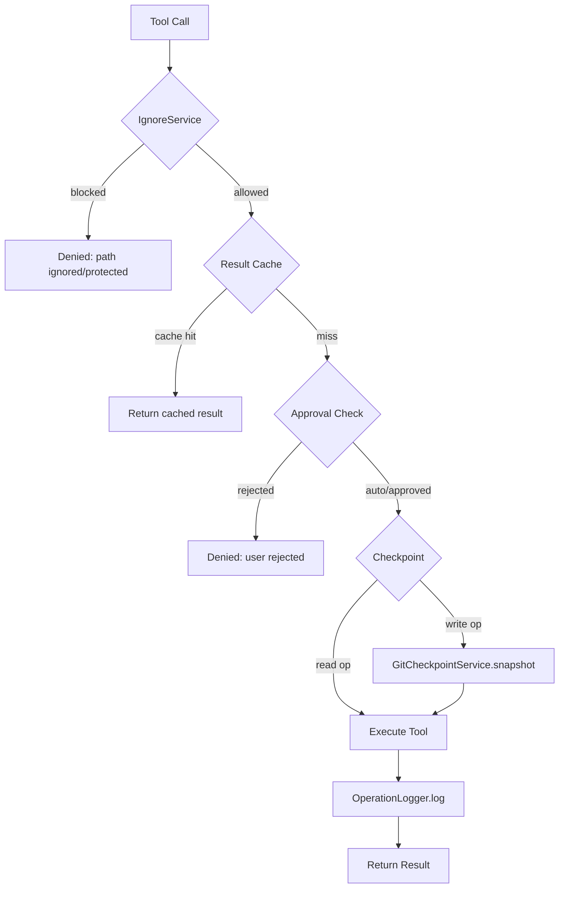
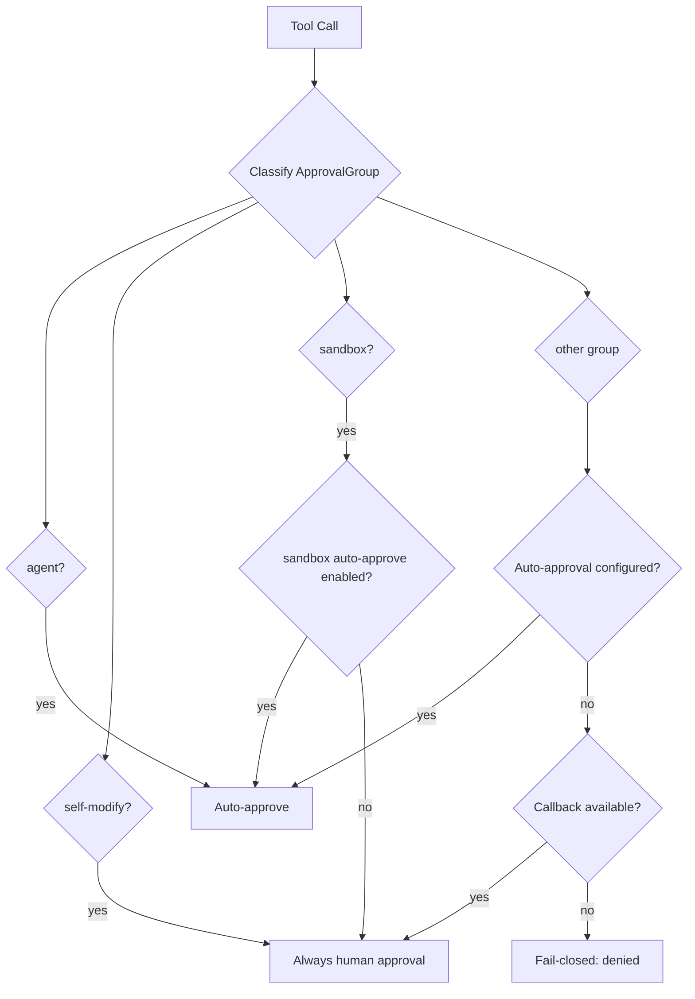

# Governance & Safety

Obsilo enforces a multi-layered governance model. Every tool call -- internal or MCP -- flows through the `ToolExecutionPipeline`, which orchestrates path validation, approval decisions, checkpoint creation, and audit logging. The system is **fail-closed**: if any governance component is uninitialized or encounters an error, the operation is denied.

## Architecture Overview

## IgnoreService

**File:** `src/core/governance/IgnoreService.ts`

Controls which vault paths the agent can access via two config files in the vault root:

| File | Effect |
|------|--------|
| `.obsidian-agentignore` | Paths completely invisible to the agent (gitignore syntax) |
| `.obsidian-agentprotected` | Paths readable but never writable, even with explicit approval |

**Always-blocked paths** (hardcoded, derived from `vault.configDir`): `.git/`, workspace files, cache directory. The governance config files themselves (`.obsidian-agentignore`, `.obsidian-agentprotected`) are always write-protected.

**Fail-closed behavior:** If `load()` has not completed, both `isIgnored()` and `isProtected()` return `true` -- denying all access until rules are loaded (ADR-005).

## OperationLogger

**File:** `src/core/governance/OperationLogger.ts`

Persistent JSONL audit trail for every tool execution. Storage at `.obsidian/plugins/obsilo-agent/logs/YYYY-MM-DD.jsonl` with 30-day retention and automatic rotation. Uses `adapter.append()` for O(1) writes.

**PII scrubbing** (`sanitizeParams()`): Sensitive keys (`password`, `token`, `api_key`, `secret`, `auth`) are replaced with `[REDACTED]`. File content fields logged as `[N chars]`. URLs have credentials stripped. Values exceeding 500 chars are truncated; tool results capped at 2000 chars.

Each log entry records: `timestamp`, `taskId`, `mode`, `tool`, `params`, `result`, `success`, `durationMs`, `error`.

## GitCheckpointService

**File:** `src/core/checkpoints/GitCheckpointService.ts`

Maintains a **shadow git repository** at `.obsidian/plugins/obsilo-agent/checkpoints/` using `isomorphic-git` (pure JS, no native binary). This provides per-file undo without touching the vault's own git history.

Before each write, the pipeline calls `snapshot(taskId, [path], toolName)`. The file's current content is committed into the shadow repo. New files (not yet existing) are tracked in a `newFiles` list so restore can delete them. Each checkpoint records: `taskId`, `commitOid`, `timestamp`, `filesChanged`, `toolName`.

An in-memory `Map<string, CheckpointInfo[]>` (`taskCheckpoints`) tracks active checkpoints per task with serial commits to prevent race conditions. Restore reverts files from shadow commits; for newly created files, restore means deletion.

## Approval Flow

**File:** `src/core/tool-execution/ToolExecutionPipeline.ts`

The pipeline classifies every tool call into an `ApprovalGroup` and decides whether it needs user consent:

### Approval Groups

| Group | Tools | Default |
|-------|-------|---------|
| `read` | read_file, list_files, search_files, semantic_search, ... | Auto-approve configurable |
| `note-edit` | write_file, edit_file, append_to_file, update_frontmatter | Requires approval |
| `vault-change` | create_folder, delete_file, move_file, generate_canvas, create_base | Requires approval |
| `web` | web_fetch, web_search | Auto when web tools enabled |
| `mcp` | use_mcp_tool | Configurable |
| `subtask` | new_task | Configurable |
| `skill` | execute_command, resolve_capability_gap, enable_plugin | Configurable |
| `plugin-api` | call_plugin_api (split into read/write tiers) | Configurable per tier |
| `recipe` | execute_recipe | Configurable |
| `sandbox` | evaluate_expression | Requires explicit opt-in |
| `self-modify` | manage_skill, manage_source | **Always** requires human approval |
| `agent` | ask_followup_question, attempt_completion, switch_mode, ... | Always auto-approved |

Self-modification tools (`manage_skill`, `manage_source`) enforce mandatory human review with no auto-approve bypass (M-7 security control).

### DiffReviewModal

**File:** `src/ui/DiffReviewModal.ts`

For note-edit approvals, the pipeline can present a semantic diff review. Changes are grouped by Markdown structure (frontmatter, headings, lists, code blocks, paragraphs) rather than raw line hunks. Users can approve, reject, or edit individual sections before confirming.

## Pipeline Execution Steps

The `executeTool()` method enforces this exact sequence for every call:

1. **Validate** -- Tool exists in the registry
2. **Governance** -- IgnoreService checks path access
3. **Cache** -- Return cached result for identical read-only calls (deduplication)
4. **Approval** -- Classify group, check auto-approve settings, request human approval if needed
5. **Checkpoint** -- Snapshot file before write (when checkpoints enabled)
6. **Execute** -- Run the tool with wrapped callbacks
7. **Log** -- Persist to OperationLogger and update result cache
8. **Chat-Linking** -- Track written `.md` paths for conversation frontmatter stamping

## Related ADRs

| ADR | Topic |
|-----|-------|
| ADR-001 | Central tool execution pipeline architecture |
| ADR-002 | Git-based checkpoint/restore via shadow repo |
| ADR-005 | Fail-closed approval model |
| ADR-010 | Permissions audit and approval group taxonomy |
