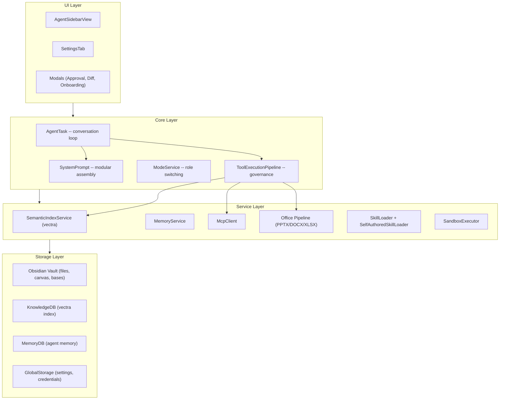

# Architecture Overview

Obsilo is an AI agent that lives inside Obsidian as a community plugin. It manages vaults, generates documents, runs semantic search, and orchestrates multi-step tasks -- all without leaving the editor. This page explains the structural decisions that make that possible.

## Design Philosophy

Three principles shape every architectural decision:

**Local-first.** All data stays in the user's vault. There are no cloud services, no telemetry endpoints, no accounts. AI API calls go directly to the provider (Anthropic, OpenAI) -- Obsilo never proxies or stores conversation content.

**Fail-closed safety.** Write operations require explicit approval by default. If the approval callback is missing, the pipeline rejects the operation -- it never silently auto-approves. This is enforced in `src/core/tool-execution/ToolExecutionPipeline.ts`, not in individual tools.

**Plugin-as-platform.** Obsilo is extensible at three levels: MCP servers for external tool integration, self-authored skills for user-defined behaviors, and a sandbox for runtime code evaluation. The agent can inspect its own logs, author new skills, and manage its tool surface -- under human supervision.

## Layer Model

## Directory Structure

| Directory | Purpose |
|-----------|---------|
| `src/core/` | AgentTask, pipeline, system prompt, modes, governance, checkpoints |
| `src/core/tools/` | 43+ tool implementations (vault, web, agent, MCP, dynamic) |
| `src/core/prompts/sections/` | 16 modular prompt section builders |
| `src/core/tool-execution/` | Pipeline, repetition detector, operation logger |
| `src/api/` | AI provider abstraction (Anthropic, OpenAI) |
| `src/ui/` | Sidebar, settings, modals, onboarding |
| `src/mcp/` | Model Context Protocol client and transport |
| `src/i18n/` | Internationalization (EN, DE) |
| `src/types/` | Shared TypeScript types and settings |

## Key Architectural Decisions

| ADR | Decision | Rationale |
|-----|----------|-----------|
| ADR-002 | Fail-closed approval pipeline | Write ops must never auto-approve silently |
| ADR-017 | Procedural recipes as structured skills | Composable multi-step workflows |
| ADR-018 | Episodic memory via tool ledger | Agent learns from past task patterns |
| ADR-022 | Chat-linking via frontmatter stamping | Traceability between conversations and vault files |
| ADR-031 | `writeBinaryToVault()` with path-traversal guard | Office docs need binary write without escaping vault |
| ADR-048 | Dual-mode PPTX pipeline (template + adhoc) | Templates for brand fidelity, adhoc for quick slides |

::: info Kilo Code Heritage
Obsilo's core loop and tool architecture are adapted from Kilo Code (an open-source AI coding agent). The adaptation replaces filesystem operations with Obsidian's vault API, adds governance layers (approval, checkpoints, ignore paths), and introduces domain-specific tools for knowledge management. Key reference files live in `forked-kilocode/` for pattern comparison.
:::

## Runtime Environment

Obsilo runs inside Obsidian's Electron process. This means:

- **No Node.js server** -- the plugin IS the backend. API calls, file I/O, and tool execution all happen in the renderer process.
- **Vault API, not `fs`** -- all file operations go through `app.vault` and `app.fileManager` to respect Obsidian's sync, indexing, and event system.
- **`requestUrl` instead of `fetch`** -- Obsidian's community plugin review bot enforces this for all HTTP calls (except SDK clients that manage their own transport).
- **CSP constraints** -- the sandbox uses `'unsafe-eval'` for `new Function()` in the isolated evaluator, but all other code paths avoid eval.

::: tip Where to Go Next
- [Agent Loop](./agent-loop) -- how a message becomes a multi-step task
- [Tool System](./tool-system) -- 43+ tools, the pipeline, and quality gates
- [System Prompt](./system-prompt) -- modular prompt assembly with 16 sections
:::
