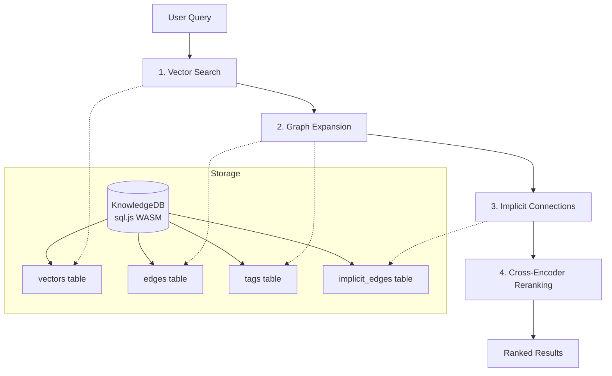
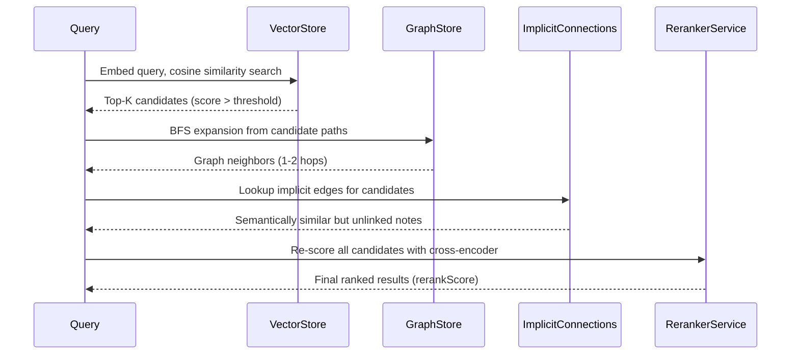

# Knowledge Layer

Obsilo's Knowledge Layer provides vault-wide semantic understanding through a 4-stage retrieval pipeline backed by a local SQLite database. All processing runs on-device -- no external API calls for search or reranking.

## Architecture Overview

## KnowledgeDB

The persistence layer uses **sql.js** (SQLite compiled to WASM) with a three-location fallback chain:

| Priority | Location | Adapter | Platform |
|----------|----------|---------|----------|
| 1 | `~/.obsidian-agent/knowledge.db` | `fs.promises` | Desktop only |
| 2 | `{vault}/.obsidian-agent/knowledge.db` | `vault.adapter` | All |
| 3 | `{vault}/{pluginDir}/knowledge.db` | `vault.adapter` | All |

Schema (v5) includes five tables: `vectors`, `edges`, `tags`, `implicit_edges`, `dismissed_pairs`, plus `schema_meta` for migrations and `checkpoint` for incremental indexing state.

**Key file:** `src/core/knowledge/KnowledgeDB.ts`

## VectorStore

Stores embedding vectors as `Float32Array` BLOBs in the `vectors` table. Search uses a bulk-loaded in-memory cache with JavaScript cosine similarity -- 10-50x faster than SQL custom functions due to JS-to-WASM overhead per row.

**Two-Pass Enrichment Strategy:**

1. **Pass 1 (fast):** Raw text chunks are embedded and stored with `enriched=0`. This provides immediate searchability after vault indexing.
2. **Pass 2 (background):** Chunks are re-embedded with contextual prefixes (file title, heading hierarchy) and updated to `enriched=1`. This improves retrieval quality without blocking the user.

Each vector entry tracks `path`, `chunk_index`, `text`, `vector` (BLOB), `mtime`, and `enriched` flag. The `UNIQUE(path, chunk_index)` constraint ensures clean replacement on re-indexing.

**Key file:** `src/core/knowledge/VectorStore.ts`

## GraphExtractor

Extracts the vault's link topology into the `edges` and `tags` tables by parsing:

- **Body Wikilinks:** `[[target]]`, `[[target|alias]]`, `[[target#heading]]` via regex
- **Frontmatter MOC properties:** Configurable property names (e.g., `parent`, `related`, `MOC`) read from Obsidian's `metadataCache`
- **Tags:** Both YAML frontmatter tags and inline `#tag` references

Supports two extraction modes: full extraction on startup (processes all vault files) and incremental updates triggered by vault events (create, modify, rename, delete).

**Key files:** `src/core/knowledge/GraphExtractor.ts`, `src/core/knowledge/GraphStore.ts`

## GraphStore

Provides BFS-based neighbor expansion for graph-augmented retrieval (ADR-051, Stage 2). Given a set of seed paths from vector search, it walks the edge graph up to a configurable hop distance and returns `GraphNeighbor` objects with `path`, `hopDistance`, `viaPath`, and `linkType`.

Edge types distinguish between `body` (inline Wikilinks) and `frontmatter` (MOC property) links, with an optional `propertyName` for frontmatter edges.

**Key file:** `src/core/knowledge/GraphStore.ts`

## ImplicitConnectionService

Discovers semantically similar notes that lack explicit links (ADR-051, Stage 3). Computes pairwise cosine similarity between note-level vectors (averaged across chunks) and stores pairs above a configurable threshold in the `implicit_edges` table. Pairs with existing explicit edges are excluded -- only genuinely hidden connections surface.

The `dismissed_pairs` table allows users to permanently suppress false positives from future results.

**Key file:** `src/core/knowledge/ImplicitConnectionService.ts`

## RerankerService

Local cross-encoder reranking using `@huggingface/transformers` with the `Xenova/ms-marco-MiniLM-L-6-v2` model. Pure JavaScript + WASM -- no native addons, no electron-rebuild, no external API calls.

The model is downloaded from HuggingFace Hub on first use and cached locally. It re-scores query-document pairs and produces a `rerankScore` that replaces the initial cosine similarity ranking. This significantly improves precision for ambiguous or multi-topic queries.

**Key file:** `src/core/knowledge/RerankerService.ts`

## 4-Stage Retrieval Pipeline

| Stage | Component | Purpose | Latency |
|-------|-----------|---------|---------|
| 1 | VectorStore | Cosine similarity over embeddings | ~50ms |
| 2 | GraphStore | BFS neighbor expansion via Wikilinks/MOC | ~10ms |
| 3 | ImplicitConnectionService | Pre-computed semantic neighbors | ~5ms |
| 4 | RerankerService | Cross-encoder precision reranking | ~200ms |

Stages 2 and 3 expand the candidate set beyond pure embedding similarity. Stage 4 applies a more expensive but more accurate scoring model to produce the final ranking.

## ADR References

- **ADR-050:** SQLite Knowledge DB -- migration from vectra JSON to sql.js WASM
- **ADR-051:** 4-Stage Retrieval Pipeline -- vector, graph, implicit, reranker
- **ADR-052:** Local Reranker Integration -- transformers.js WASM backend selection
