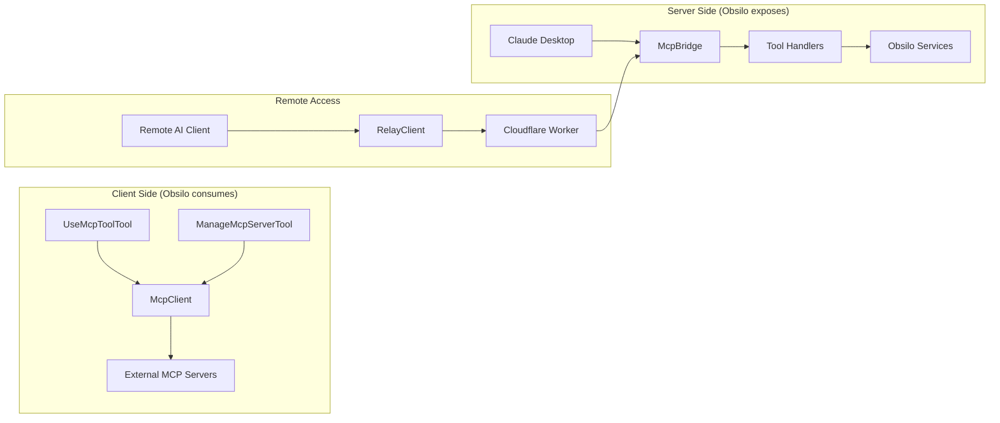
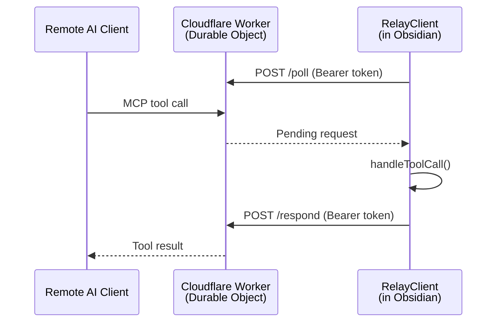

# MCP Architecture

Obsilo implements MCP (Model Context Protocol) on both sides: as a **client** consuming external MCP servers, and as a **server** exposing vault intelligence to AI assistants like Claude Desktop. The server side includes an optional remote relay for access outside the local network.

## Dual-Role Overview

## Client Side

### McpClient

Manages connections to external MCP servers. Supports three transport protocols:

| Transport | Use Case | Implementation |
|-----------|----------|----------------|
| `streamable-http` | Modern HTTP-based servers | `StreamableHTTPClientTransport` |
| `sse` | Legacy SSE-based servers | `SSEClientTransport` (fallback) |
| `stdio` | Local process servers | `StdioClientTransport` |

Intentionally lean: no OAuth, no file-watching, no auto-reconnect. Uses the `@modelcontextprotocol/sdk` client library.

**Key file:** `src/core/mcp/McpClient.ts`

### Agent-Facing Tools

- **`UseMcpToolTool`** -- forwards tool calls from the agent to the appropriate MCP server via McpClient
- **`ManageMcpServerTool`** -- allows the agent to list, connect, and disconnect MCP servers at runtime

**Key files:** `src/core/tools/mcp/UseMcpToolTool.ts`, `src/core/tools/agent/ManageMcpServerTool.ts`

## Server Side: McpBridge

The `McpBridge` hosts a local HTTP server on `localhost:27182` speaking the MCP Streamable HTTP protocol. Claude Desktop (or any MCP client) connects via URL.

All tool calls are dispatched directly to Obsilo's services in the renderer process -- no IPC or child process needed. Requires Obsidian to be running.

**Key file:** `src/mcp/McpBridge.ts`

### 3-Tier Tool Mapping

Tools exposed via MCP are organized into three tiers by risk level:

| Tier | Tools | Risk | Description |
|------|-------|------|-------------|
| **Tier 1: Read** | `get_context`, `search_vault`, `read_notes` | Low | Read-only vault access, context loading |
| **Tier 2: Session** | `sync_session`, `update_memory` | Medium | Session replication, memory updates |
| **Tier 3: Write** | `write_vault`, `execute_vault_op` | High | Create, edit, delete vault files |

`get_context` is designed to be called first in every conversation. It returns user profile, memory, behavioral patterns, vault statistics, available skills, and rules -- the full operating context.

`search_vault` wraps the complete 4-stage retrieval pipeline (vector search, graph expansion, implicit connections, reranking) into a single MCP tool call.

**Key file:** `src/mcp/tools/index.ts`

### System Context Prompt

The `buildPrompts()` function generates an `obsilo-system-context` prompt that replaces the system prompt for MCP-connected AI clients. It defines the operating rules, tool usage guidelines, and the critical requirement to call `sync_session` at conversation end.

**Key file:** `src/mcp/prompts/systemContext.ts`

### Auto Session Tracking

All MCP tool calls are automatically tracked as sessions in Obsilo's chat history. A 5-minute inactivity timeout determines session boundaries. This ensures MCP conversations appear in the history sidebar even if the AI client never explicitly calls `sync_session`.

## Remote Relay

For access outside the local network (e.g., Claude Desktop on a different machine, or mobile scenarios).

### RelayClient

HTTP long-polling client running inside Obsidian. Uses `requestUrl` (not WebSocket) to communicate with the relay, which works within Obsidian's renderer CSP that blocks WebSocket to external servers.

Security (AUDIT-005): token sent via Authorization header (never in URL), no token material in logs, runtime validation of relay responses, HTTPS enforced.

**Key file:** `src/mcp/RelayClient.ts`

### CloudflareDeployer

Deploys the Obsilo Relay Worker to Cloudflare via REST API -- no CLI, no wrangler, no terminal. Uses `requestUrl` to:

1. Discover the Cloudflare account ID
2. Upload the worker script with Durable Object bindings
3. Configure the shared auth secret

**Key file:** `src/mcp/CloudflareDeployer.ts`

## Memory Transparency

Sessions created via MCP carry a `source: 'mcp'` field in MemoryDB, distinguishing them from direct conversations (`source: 'human'`). This allows the memory system and UI to surface the origin of learned facts.

## ADR References

- **ADR-053:** MCP Server Process Architecture -- HTTP instead of stdio+IPC
- **ADR-054:** MCP Client Integration -- transport selection, tool forwarding
- **ADR-055:** Remote MCP Relay -- Cloudflare Workers, Durable Objects, security model
