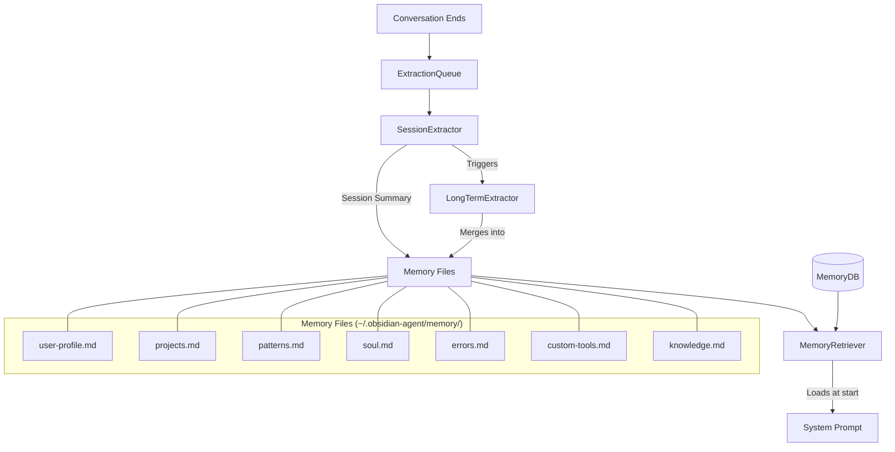

# Memory System

Obsilo maintains durable memory across conversations through a 3-tier architecture: session summaries extracted automatically, long-term facts promoted from sessions, and soul memory defining the agent's identity. All memory is stored locally and loaded into the system prompt at conversation start.

## Architecture

## Three Memory Tiers

### Tier 1: Session Memory

Automatic summaries extracted at the end of each conversation. The `SessionExtractor` uses a constrained LLM call to produce a structured Markdown summary covering:

1. **Summary** -- what was accomplished (2-3 sentences)
2. **Decisions** -- key choices made
3. **User Preferences** -- communication style, workflow habits
4. **Task Outcome** -- success, corrections needed
5. **Tool Effectiveness** -- which tools helped or caused problems
6. **Learnings** -- what worked, what to change
7. **Open Questions** -- unresolved items

Session summaries are saved to `memory/sessions/{conversationId}.md` and indexed for semantic search.

**Key file:** `src/core/memory/SessionExtractor.ts`

### Tier 2: Long-term Memory

Durable facts promoted from session summaries into persistent memory files. The `LongTermExtractor` receives a session summary and the current state of all memory files, then merges genuinely new information -- avoiding duplication.

Target files and their purpose:

| File | Content | System Prompt |
|------|---------|---------------|
| `user-profile.md` | Identity, communication preferences | Yes (~200 tokens) |
| `projects.md` | Active projects, goals, context | Yes (~300 tokens) |
| `patterns.md` | Behavioral patterns, workflow habits | Yes (~200 tokens) |
| `soul.md` | Agent identity, personality, values | Yes (~200 tokens) |
| `errors.md` | Known errors, failure patterns | On-demand |
| `custom-tools.md` | Dynamic tool documentation | On-demand |
| `knowledge.md` | Domain knowledge, references | On-demand (semantic search) |

**Key file:** `src/core/memory/LongTermExtractor.ts`

### Tier 3: Soul Memory

Inspired by OpenClaw's SOUL.md concept. Defines the agent's core identity, personality traits, and behavioral guidelines. Unlike other memory files, soul.md is seeded during onboarding and rarely modified -- it represents the stable foundation of the agent's character.

## MemoryService

Central orchestrator for reading and writing memory files. Provides the `getMemoryFiles()` method used by the system prompt builder to inject memory context. Manages file creation (with templates for new users), updates, and statistics.

Memory files are stored globally at `~/.obsidian-agent/memory/`, shared across all vaults.

**Key file:** `src/core/memory/MemoryService.ts`

## ExtractionQueue

Persistent FIFO queue for background memory extraction jobs. Survives Obsidian restarts via `pending-extractions.json`. Processes one item at a time with a configurable delay between items.

Queue items have a `type` field: `'session'` routes to SessionExtractor, `'long-term'` routes to LongTermExtractor. After a session extraction completes, the queue automatically enqueues a long-term extraction for the same conversation.

**Key file:** `src/core/memory/ExtractionQueue.ts`

## MemoryRetriever

Cross-session context retrieval via semantic search over indexed session summaries and task episodes. On new conversation start, it searches for relevant past sessions and returns formatted context for injection into the system prompt.

- **Primary path:** Semantic search over indexed session summaries + episodes
- **Fallback:** Most recent 3 session summaries by file date (when no semantic index)
- **Budget:** 4000 chars total (shared between sessions and episodes)

**Key file:** `src/core/memory/MemoryRetriever.ts`

## MemoryDB

SQLite storage for structured memory data, separate from KnowledgeDB. Uses the same sql.js WASM engine but a different database file (`memory.db`). Four tables:

| Table | Purpose |
|-------|---------|
| `sessions` | Conversation metadata (id, title, summary, source, timestamp) |
| `episodes` | Task execution records (tools used, success/failure, result summary) |
| `recipes` | Learned multi-step workflows (trigger keywords, steps, success count) |
| `patterns` | Recurring tool sequences extracted from episodes |

The `source` field on sessions distinguishes `'human'` (direct) from `'mcp'` (via MCP connector) conversations.

**Key file:** `src/core/knowledge/MemoryDB.ts`

## OnboardingService

Conversational onboarding that guides new users through initial setup. Uses a single monolithic prompt -- no step-switching. The LLM follows a scripted conversation flow, collecting all information first and applying settings in a batch at the end.

Collects: user name, role, communication preferences, project context, and vault structure. Seeds the initial memory files from the collected data.

**Key file:** `src/core/memory/OnboardingService.ts`

## ADR Reference

- **ADR-013:** Memory Architecture -- 3-tier design, extraction pipeline, storage strategy
