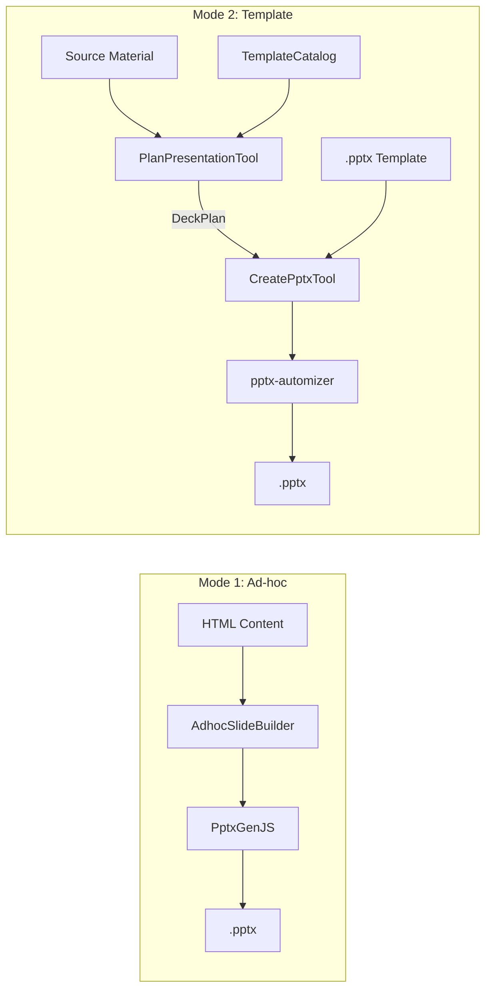

# Office Pipeline

Obsilo creates and parses office documents (PPTX, DOCX, XLSX, PDF, CSV) entirely on-device. The PPTX pipeline is the most sophisticated component, offering two generation modes backed by an internal LLM-driven planning step.

## PPTX Creation: Two Modes

### Mode 1: Ad-hoc (PptxGenJS)

For quick presentations without a template. The `AdhocSlideBuilder` converts structured HTML content into PptxGenJS API calls. Best for simple layouts where template fidelity is not required.

### Mode 2: Template (pptx-automizer)

For professional presentations using corporate templates. This is a multi-step pipeline:

1. **PlanPresentationTool** -- internal constrained LLM call that transforms source material into a `DeckPlan`
2. **CreatePptxTool** -- generates the .pptx file from the DeckPlan using pptx-automizer

## PlanPresentationTool

The planning step runs an internal LLM call with a constrained prompt that enforces source-grounded, outline-first content transformation:

1. **Analyze** source material and extract key messages
2. **Select** appropriate slide types from the template catalog
3. **Generate** content for every non-decorative shape
4. **Validate** the plan against the catalog (required shapes, shape names, placeholders)

The tool returns a `DeckPlan` -- a typed JSON structure describing each slide, its layout, and the content for every shape. This plan is then fed directly to `create_pptx`.

**Key design decision (ADR-048):** Content transformation happens at tool level via a constrained internal LLM call, not as a prompt suggestion to the outer agent. This ensures consistent output quality regardless of the outer model.

**Key file:** `src/core/tools/vault/PlanPresentationTool.ts`

## TemplateCatalog

Registry of available slide types, their shapes, and content capacity. Catalogs are JSON files stored alongside .pptx templates in the vault under `.obsilo/themes/{theme_name}/`.

Default themes (executive, modern, minimal) are bundled with the plugin. Each catalog entry describes:

- **Slide type name** and purpose
- **Shapes** with name, content type (10 types supported), and capacity
- **`special_role`** metadata (e.g., `section_number` for auto-incrementing)
- **`group_id`** for shapes that must maintain consistency

The catalog loader resolves templates from both bundled and user-provided sources, with staleness warnings when templates change.

**Key file:** `src/core/office/pptx/TemplateCatalog.ts`

## CreatePptxTool

Generates the final .pptx from a DeckPlan using pptx-automizer (the `TemplateEngine`). Features:

- **Required-shape validation:** Ensures all mandatory shapes have content
- **Placeholder detection:** Warns about unfilled template placeholders
- **Auto-remove:** Strips unused optional shapes from slides
- **Auto-upgrade:** Promotes content types when the shape supports a richer format

The generated binary is written to the vault via `writeBinaryToVault()`.

## DOCX and XLSX

| Tool | Library | Capabilities |
|------|---------|-------------|
| `CreateDocxTool` | docx | Headings, paragraphs, lists, tables, images, styles |
| `CreateXlsxTool` | ExcelJS | Sheets, typed cells, formulas, column widths, styling |

Both tools accept structured content from the agent and produce binary files written via `writeBinaryToVault()`.

## Binary Write Security

`writeBinaryToVault()` enforces path-traversal protection (ADR-031). All output paths are validated against the vault root before writing. This is the single write path for all binary document creation.

## Document Parsing

The `ReadDocumentTool` provides parsing for incoming documents:

| Format | Parser | Output |
|--------|--------|--------|
| PPTX | Built-in (slide + shape extraction) | Structured text per slide |
| DOCX | Built-in (paragraph + table extraction) | Markdown-like text |
| XLSX | ExcelJS | Sheet data as structured text |
| PDF | pdf-parse | Plain text with page breaks |
| CSV | Built-in | Structured rows |

## RenderPresentationTool

Visual QA for generated presentations. Uses LibreOffice in headless mode to render each slide as a PNG image. The rendered images are returned as base64 content blocks, allowing the agent to visually verify the output before delivering to the user.

Desktop-only (requires LibreOffice installed).

## ADR References

- **ADR-046:** Office Document Strategy -- library selection, binary write pattern
- **ADR-047:** Document Parsing Pipeline -- parser architecture, format support
- **ADR-048:** PPTX Content Pipeline -- plan_presentation design, constrained LLM call, 2-mode architecture
