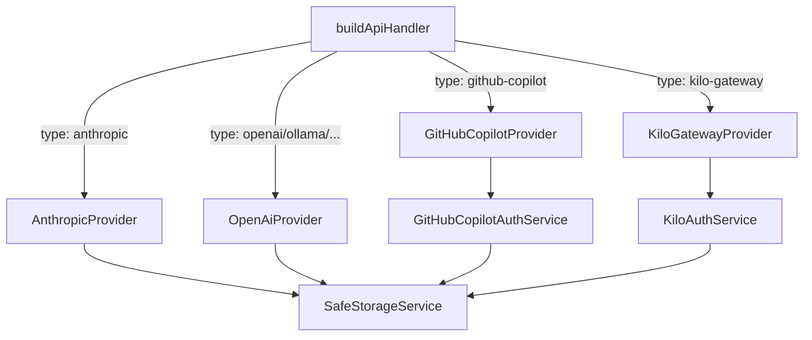
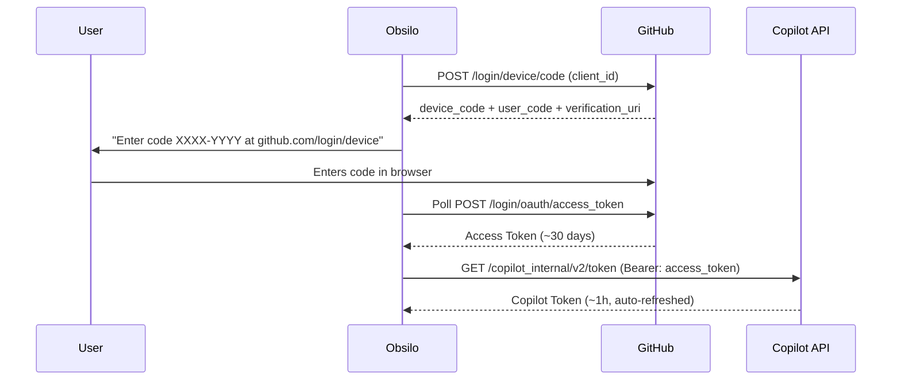

# Provider Authentication

Obsilo supports multiple LLM providers through a unified `ApiHandler` interface. Each provider manages its own authentication flow, streaming format, and token lifecycle. All HTTP calls use Obsidian's `requestUrl` for Review-Bot compliance.

## Provider Architecture

The `ApiHandler` interface defines a single method: `createMessage()` returning an `ApiStream` (async iterable of typed chunks: `text`, `thinking`, `tool_use`, `tool_error`, `usage`). The internal message format follows Anthropic's structure; each provider converts to/from its native format.

**Key files:** `src/api/types.ts` (interface), `src/api/index.ts` (factory)

## Supported Providers

| Provider | Auth Method | Streaming | Key Files |
|----------|------------|-----------|-----------|
| Anthropic | API key | SSE (native SDK) | `src/api/providers/anthropic.ts` |
| GitHub Copilot | OAuth Device Code Flow | OpenAI SDK + custom fetch | `src/api/providers/github-copilot.ts` |
| Kilo Gateway | Device Auth / Manual Token | OpenAI SDK + custom fetch | `src/api/providers/kilo-gateway.ts` |
| OpenAI | API key | OpenAI SDK (native) | `src/api/providers/openai.ts` |
| Ollama / LM Studio | No auth (local) | OpenAI-compatible | `src/api/providers/openai.ts` |
| OpenRouter | API key | OpenAI-compatible | `src/api/providers/openai.ts` |
| Azure OpenAI | API key | OpenAI SDK | `src/api/providers/openai.ts` |

## GitHub Copilot: 3-Stage Token Chain

The most complex auth flow. Implements the same OAuth sequence used by GitHub Copilot extensions:

**Stage 1:** Device Code Flow -- user authorizes in browser using a short code. Client ID: `Iv1.b507a08c87ecfe98` (VS Code's public client ID).

**Stage 2:** Access Token -- long-lived (~30 days), stored encrypted via SafeStorageService.

**Stage 3:** Copilot Token -- short-lived (~1h), automatically refreshed before expiry. Used in a custom `fetch` wrapper injected into the OpenAI SDK.

**Key file:** `src/core/security/GitHubCopilotAuthService.ts`

## Kilo Gateway: Device Authorization

Two authentication modes landing in the same session state (`KiloSession`):

**Mode 1 -- Device Authorization Flow:** Browser-based, similar to GitHub's flow. Uses Kilo's `/device-auth/codes` endpoint. The user authorizes in browser, and the service polls for completion.

**Mode 2 -- Manual Token:** Direct API token entry for environments where browser auth is impractical.

After authentication, `KiloMetadataService` fetches organization context, available models, and usage defaults from Kilo's profile and defaults endpoints.

**Key file:** `src/core/security/KiloAuthService.ts`

## SafeStorageService

Encrypts API keys and tokens using Electron's `safeStorage` API, which delegates to the OS keychain:

| Platform | Backend |
|----------|---------|
| macOS | Keychain Services |
| Windows | DPAPI (Data Protection API) |
| Linux | libsecret (GNOME Keyring / KWallet) |

Encrypted values are stored as `enc:v1:<base64>` in `data.json`. The prefix allows detection of encrypted vs. plaintext values. Fallback: when `safeStorage` is unavailable (e.g., certain Linux configurations), values pass through as plaintext.

**Key file:** `src/core/security/SafeStorageService.ts`

## Provider-Specific Streaming

All providers emit the same `ApiStreamChunk` union type, but the underlying transport differs:

- **Anthropic:** Native SDK streaming with server-sent events
- **GitHub Copilot / Kilo:** OpenAI SDK with injected custom `fetch` wrapper that adds auth headers and handles token refresh transparently
- **OpenAI / Compatible:** Standard OpenAI SDK streaming
- **Local (Ollama, LM Studio):** OpenAI-compatible HTTP with no auth

The custom fetch wrappers (`getCopilotFetch()`, `getKiloFetch()`) are the bridge between Obsidian's `requestUrl` requirement and the OpenAI SDK's expectation of a standard `fetch` function.

## ADR References

- **ADR-036:** Streaming Strategy -- unified stream format across providers
- **ADR-037:** Provider Architecture -- ApiHandler interface, factory pattern
- **ADR-038:** Token Storage -- SafeStorageService, encrypted persistence
- **ADR-040:** Kilo Provider Architecture
- **ADR-041:** Kilo Auth and Session Architecture
- **ADR-043:** Provider-specific streaming differences
