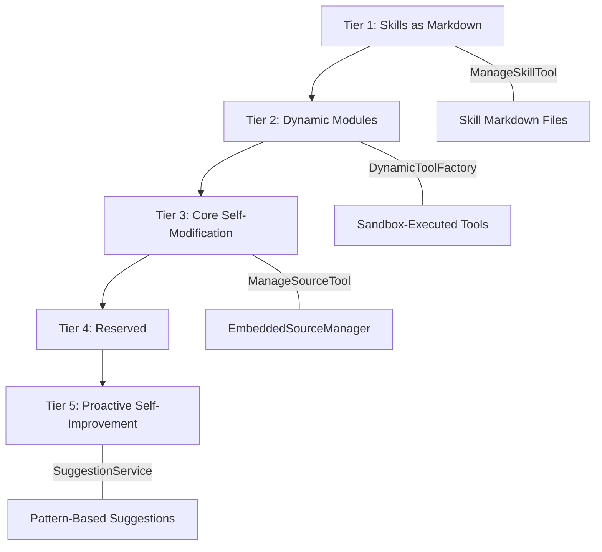

# Self-Development

Obsilo implements a 5-tier self-development framework that enables the agent to extend its own capabilities at runtime -- from writing Markdown skill guides to modifying its own source code and rebuilding the plugin.

## Tier Overview

| Tier | Capability | Isolation | Risk |
|------|-----------|-----------|------|
| 1 | Skills as Markdown | None (prompt only) | Minimal |
| 2 | Dynamic Modules | Sandbox (process/iframe) | Contained |
| 3 | Core Self-Modification | AST validation + backup | Significant |
| 4 | (Reserved) | -- | -- |
| 5 | Proactive Self-Improvement | Advisory only | Minimal |

## Tier 1: Skills as Markdown

Skills are Markdown files containing structured instructions for specific task types. The agent writes and manages them via `ManageSkillTool` -- no code execution involved.

**SelfAuthoredSkillLoader** discovers self-authored skills from the skills directory and makes them available to the agent. Skills are loaded into the system prompt when their trigger conditions match the current task.

**Key files:** `src/core/tools/agent/ManageSkillTool.ts`, `src/core/skills/SelfAuthoredSkillLoader.ts`

## Tier 2: Dynamic Modules

The agent creates new tools at runtime that execute in a sandboxed environment. Three components collaborate:

### DynamicToolFactory

Creates `BaseTool` subclass instances from dynamic tool definitions. Each dynamic tool specifies its name, description, input schema, and TypeScript source code. The source is compiled via `EsbuildWasmManager` and executed in the sandbox.

**Key file:** `src/core/tools/dynamic/DynamicToolFactory.ts`

### EsbuildWasmManager

On-demand TypeScript compilation via esbuild-wasm. Both the JavaScript module and the WASM binary are downloaded from CDN on first use and cached in the plugin data directory.

Two compilation modes:
- **`transform()`** -- single file, no imports (~100ms)
- **`build()`** -- bundle with npm dependencies via virtual filesystem (~500ms-2s)

CDN module loading uses `esm.sh` with `?bundle` parameter (preferred) and `jsdelivr` as fallback. The `resolveInternalImports()` function recursively downloads transitive CDN imports.

**Key file:** `src/core/sandbox/EsbuildWasmManager.ts`

### EvaluateExpressionTool

Allows the agent to execute arbitrary TypeScript expressions in the sandbox for one-off computations, data transformations, or vault batch operations.

**Key file:** `src/core/tools/agent/EvaluateExpressionTool.ts`

## Sandbox Isolation

Two sandbox executors provide platform-appropriate isolation:

### ProcessSandboxExecutor (Desktop)

OS-level isolation via `child_process.fork()` with `ELECTRON_RUN_AS_NODE=1`. Spawns a separate Node.js process with:

- `vm.createContext()` scope isolation (no `process`, `require`, `fs` access)
- 128 MB heap limit (`--max-old-space-size=128`)
- IPC bridge for vault and HTTP operations

**Key file:** `src/core/sandbox/ProcessSandboxExecutor.ts`

### IframeSandboxExecutor (Mobile)

Fallback for mobile platforms where `child_process` is unavailable. Creates a sandboxed iframe with `sandbox="allow-scripts"` providing V8 origin isolation. Communication via `postMessage`.

CSP: `script-src 'unsafe-inline' 'unsafe-eval'` (required for `new Function()` in sandbox).

**Key file:** `src/core/sandbox/IframeSandboxExecutor.ts`

### SandboxBridge

Plugin-side bridge handling all cross-boundary requests from the sandbox. Controls:

- **Vault access** -- read/write operations with path validation
- **URL allowlisting** -- only permitted CDN domains (unpkg.com, esm.sh, cdn.jsdelivr.net)
- **Rate limiting** -- max 10 writes/min, 5 HTTP requests/min
- **Circuit breaker** -- disables bridge after 20 consecutive errors

**Key file:** `src/core/sandbox/SandboxBridge.ts`

## Tier 3: Core Self-Modification

The most powerful tier: the agent can read, modify, and rebuild its own source code.

### EmbeddedSourceManager

Manages TypeScript source code embedded in `main.js` at build time. The esbuild embed-source plugin injects all source files as a base64-encoded constant (`EMBEDDED_SOURCE`). Provides methods to read, search, and modify source files in memory.

**Key file:** `src/core/self-development/EmbeddedSourceManager.ts`

### ManageSourceTool

Agent-facing tool for core self-modification. Exposes operations: `list_files`, `read_file`, `search`, `modify_file`. All modifications go through AST validation before being accepted.

**Key file:** `src/core/tools/agent/ManageSourceTool.ts`

### PluginBuilder

Compiles the full plugin from modified source using esbuild-wasm. Creates a new `main.js` from the in-memory source files managed by EmbeddedSourceManager, using a virtual filesystem that resolves imports from memory.

**Key file:** `src/core/self-development/PluginBuilder.ts`

### PluginReloader

Hot-reloads the plugin after a rebuild. Creates a backup of the current `main.js`, writes the new bundle, and triggers Obsidian's plugin disable/enable cycle.

**Key file:** `src/core/self-development/PluginReloader.ts`

## Tier 5: Proactive Self-Improvement

### SuggestionService

Analyzes agent episodes and patterns from MemoryDB to proactively suggest self-improvement actions:

| Pattern Detected | Suggestion Type |
|-----------------|----------------|
| Repeated workflows | Create a skill |
| Repeated errors | Apply fix from errors.md |
| Frequent tool sequences | Create a dynamic tool |

Suggestions are advisory -- they surface as `SuggestionBanner` in the UI for the user to approve or dismiss.

**Key file:** `src/core/mastery/SuggestionService.ts`

### LongTermExtractor

Also part of Tier 5: automatically promotes durable learnings from session summaries into long-term memory files, ensuring the agent continuously improves its context without manual intervention.

**Key file:** `src/core/memory/LongTermExtractor.ts`

## ADR Reference

- **ADR-021:** Sandbox OS-Level Process Isolation -- ProcessSandboxExecutor design, security model, fallback strategy
