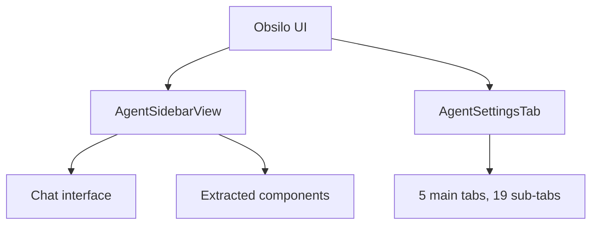

# UI architecture

Obsidian plugins can't use React, Vue, or any framework that relies on `innerHTML`. The Community Plugin review bot rejects plugins that set `innerHTML` directly. Everything in Obsilo's UI is built with Obsidian's DOM API: `createEl`, `createDiv`, `createSpan`, `appendText`. More verbose than JSX, but it's what the platform requires.

## Two main components

`AgentSidebarView` (`src/ui/AgentSidebarView.ts`) is the chat interface. It extends Obsidian's `ItemView` and renders in a sidebar leaf. This is where you type messages, see responses, attach files, and watch the agent work. The view manages the `AgentTask` lifecycle -- creating tasks, sending messages, handling streaming responses, and displaying tool execution results. It also handles the mode selector button, model selector, context badge display, and stop/send controls.

`AgentSettingsTab` (`src/ui/AgentSettingsTab.ts`) is the settings interface. It extends `PluginSettingTab` and organizes configuration across 5 main tabs, each with sub-tabs:

| Main tab | Sub-tabs |
|----------|----------|
| Providers | Models, Embeddings, Web Search, MCP Servers |
| Agent Behaviour | Modes, Permissions, Loop, Memory, Rules, Workflows, Skills, Prompts |
| Vault | (single tab) |
| Advanced | Interface, Shell, Visual Intelligence, Log, Debug, Backup |
| Language | (single tab) |

Each sub-tab is its own class in `src/ui/settings/`. The settings tab builds a navigation bar and delegates rendering to the active sub-tab class. This keeps the 1,500+ lines of settings UI manageable.

## Sidebar extracted components

The sidebar started as a single large file. As features accumulated, components were extracted into `src/ui/sidebar/`:

| Component | Purpose |
|-----------|---------|
| `AttachmentHandler` | Drag-and-drop file attachments, document parsing |
| `AutocompleteHandler` | Slash commands and @-mentions in the input |
| `ToolPickerPopover` | Tool selection popup when the agent needs to choose |
| `VaultFilePicker` | File selection from the vault |
| `HistoryPanel` | Conversation history browser |
| `ContextDisplay` | Token usage and context window visualization |
| `CondensationFeedback` | Notification when context condensing occurs |
| `SuggestionBanner` | Proactive suggestions from the agent |
| `OnboardingFlow` | First-run setup wizard |

These components follow a common pattern: they receive a parent element and the plugin instance, create their DOM subtree, and expose methods for updates. There is no component lifecycle manager. It's a convention for organizing code: each component owns a DOM subtree and exposes a small public API.

## CSS constraints

Inline styles (`element.style.color = 'red'`) are banned by the review bot. All styling goes through CSS classes prefixed with `agent-` (for the sidebar) or `agent-settings-` (for settings). Utility classes use the `agent-u-` prefix. When a style needs to be set dynamically (like a progress bar width), the code uses `style.setProperty()` instead of direct property assignment.

The CSS is authored as a single stylesheet bundled with the plugin. Obsidian's built-in theme variables (`--text-normal`, `--background-primary`, etc.) are used wherever possible so the plugin adapts to light/dark themes and custom themes.

## Modal system

Beyond the two main components, Obsilo uses Obsidian's `Modal` class for dialogs: model configuration, code import, content editing, system prompt preview, task selection, and mode creation. Each modal is a separate class in `src/ui/settings/` or `src/ui/`. Modals follow Obsidian's pattern -- extend `Modal`, override `onOpen` and `onClose`, build the DOM in `onOpen`.

## Rendering approach

There's no virtual DOM, no diffing, no reactive state. When something changes, the relevant section is cleared and rebuilt. The settings tab calls `this.display()` which empties the container and reconstructs everything. The sidebar is more surgical -- individual message elements are appended to the chat container during streaming, and only specific elements are updated when tool results arrive.

Markdown rendering in chat responses uses Obsidian's built-in `MarkdownRenderer.render()`, which handles syntax highlighting, Wikilinks, and embedded content. This is one area where Obsilo gets framework-level rendering for free.

## i18n

All user-facing text goes through the `t()` function (`src/i18n`), which returns the localized string for the current language. The settings UI, sidebar labels, error messages, and tool descriptions are all translatable. Adding a new language means adding a locale file in `src/i18n/locales/`.

## Task extraction and context

Two features sit between the chat UI and the rest of the system. The `TaskExtractor` (`src/core/tasks/TaskExtractor.ts`) scans conversation messages for action items and presents them in a selection modal. Selected tasks can be turned into vault notes via `TaskNoteCreator`. The `ContextTracker` (`src/core/context/ContextTracker.ts`) monitors token usage throughout the conversation and feeds the `ContextDisplay` component, which shows how full the context window is and when condensation is approaching.

## The framework trade-off

Building UI without a framework is slower and more repetitive than React or Svelte. Every button needs `createEl('button')`, every list needs manual DOM construction. But it has one real advantage: there's no build step for the UI, no framework version to maintain, and no compatibility issues with Obsidian updates. The DOM API is stable and unlikely to break between Obsidian versions. More verbose code in exchange for more durable compatibility -- worth it for a plugin that needs to run reliably across many Obsidian versions.
