# UI Architecture

Obsilo's UI runs inside Obsidian's Electron shell. All rendering uses the Obsidian DOM API (`createEl`, `createDiv`, `appendText`) -- `innerHTML` is prohibited by the Community Plugin review bot. Styling uses CSS classes rather than inline `element.style` assignments.

## Component Map

```mermaid
graph TD
    ASV[AgentSidebarView<br>~3600 LOC] --> SB[SuggestionBanner]
    ASV --> OF[OnboardingFlow]
    ASV --> CF[CondensationFeedback]
    ASV --> CD[ContextDisplay]
    ASV --> ACH[AutocompleteHandler]
    ASV --> ATH[AttachmentHandler]
    ASV --> HP[HistoryPanel]
    ASV --> TPP[ToolPickerPopover]
    ASV --> VFP[VaultFilePicker]
    AST[AgentSettingsTab] --> MT[ModelsTab]
    AST --> ET[EmbeddingsTab]
    AST --> WST[WebSearchTab]
    AST --> MOT[ModesTab]
    AST --> PT[PermissionsTab]
    AST --> LT[LoopTab]
    AST --> RT[RulesTab]
    AST --> WT[WorkflowsTab]
    AST --> SKT[SkillsTab]
    AST --> PRT[PromptsTab]
    AST --> MCT[McpTab]
    AST --> VIT[VisualIntelligenceTab]
    AST --> VT[VaultTab]
    AST --> IT[InterfaceTab]
    AST --> LOT[LogTab]
    AST --> DT[DebugTab]
    AST --> BT[BackupTab]
    AST --> MET[MemoryTab]
    AST --> SHT[ShellTab]
    AST --> LGT[LanguageTab]
```

## AgentSidebarView

**File:** `src/ui/AgentSidebarView.ts` (~3600 LOC)

The main chat panel, registered as a custom `ItemView` with type `obsidian-agent-sidebar`. This is a monolith that has been partially refactored -- key concerns have been extracted into dedicated components under `src/ui/sidebar/`.

**Core responsibilities:**
- Chat message rendering with Markdown support (via `MarkdownRenderer`)
- Input area with textarea, mode selector, model selector, send/stop controls
- Tool call visualization (approval cards, progress indicators, result display)
- Task lifecycle management (start, cancel, conversation persistence)
- Context tracking and token budget display

### Extracted Sidebar Components

**Directory:** `src/ui/sidebar/`

| Component | Purpose |
|-----------|---------|
| `SuggestionBanner` | Displays contextual suggestions above the input area |
| `OnboardingFlow` | First-run guided setup experience |
| `CondensationFeedback` | Shows context condensation status and token savings |
| `ContextDisplay` | Token budget bar and context window utilization |
| `AutocompleteHandler` | Slash-command and mention autocomplete in the input area |
| `AttachmentHandler` | File attachment management for multimodal input |
| `HistoryPanel` | Conversation history browser with search and filtering |
| `ToolPickerPopover` | Tool selection popover for manual tool invocation |
| `VaultFilePicker` | File picker for `@`-mention file references |

## AgentSettingsTab

**File:** `src/ui/AgentSettingsTab.ts`

A tab-based settings interface extending Obsidian's `PluginSettingTab`. The display is organized into 19 sub-tabs, each extracted into its own module under `src/ui/settings/`:

ModelsTab, EmbeddingsTab, WebSearchTab, ModesTab, PermissionsTab, LoopTab, RulesTab, WorkflowsTab, SkillsTab, PromptsTab, McpTab, VisualIntelligenceTab, VaultTab, InterfaceTab, LogTab, DebugTab, BackupTab, MemoryTab, ShellTab, LanguageTab.

Each tab module exports a render function that receives the settings container element and plugin reference, keeping the main `AgentSettingsTab` class as a thin router.

## Modals

**Directory:** `src/ui/` and `src/ui/settings/`

| Modal | Location | Purpose |
|-------|----------|---------|
| `DiffReviewModal` | `src/ui/DiffReviewModal.ts` | Multi-file semantic diff review with per-section approve/reject/edit. Groups changes by Markdown structure (headings, frontmatter, code blocks) |
| `ChatHistoryModal` | `src/ui/ChatHistoryModal.ts` | Browse and restore past conversations |
| `TaskSelectionModal` | `src/ui/TaskSelectionModal.ts` | Select extracted tasks for creation as vault notes |
| `ModelConfigModal` | `src/ui/settings/ModelConfigModal.ts` | Configure AI model parameters (temperature, max tokens, provider settings) |
| `ContentEditorModal` | `src/ui/settings/ContentEditorModal.ts` | Full-screen text editor for rules, prompts, and skill content |
| `SystemPromptPreviewModal` | `src/ui/settings/SystemPromptPreviewModal.ts` | Read-only preview of the assembled system prompt |
| `CodeImportModal` | `src/ui/settings/CodeImportModal.ts` | Import code modules into skills |
| `NewModeModal` | `src/ui/settings/NewModeModal.ts` | Create or edit custom mode configurations |

## CSS Architecture

**File:** `styles.css`

All styles use the `agent-` prefix to avoid conflicts with Obsidian core and other plugins. The stylesheet follows two patterns:

1. **Component classes** (`agent-sidebar-*`, `agent-settings-*`, `agent-modal-*`) -- scoped to specific UI components
2. **Utility classes** (`agent-u-*`) -- small, reusable helpers for common layout needs:
   - `agent-u-hidden` / `agent-u-visible` -- display toggling
   - `agent-u-visibility-hidden` -- hidden but retains layout space
   - `agent-u-height-auto` -- override fixed heights
   - `agent-u-mb-12` -- spacing utility

## Obsidian DOM API Constraints

The following rules are enforced by the Obsidian Community Plugin review bot and shape every UI decision:

| Prohibited | Required Alternative |
|------------|---------------------|
| `innerHTML` | `createEl()`, `createDiv()`, `appendText()` |
| `element.style.X = Y` | CSS classes or `style.setProperty()` |
| `document.createElement()` | Obsidian's `createEl()` on parent elements |
| Direct DOM event listeners (for cleanup) | Obsidian's `registerDomEvent()` |

Markdown content is rendered exclusively through Obsidian's `MarkdownRenderer.render()`, which handles links, embeds, and plugin-specific syntax (Dataview, Tasks, Mermaid).
