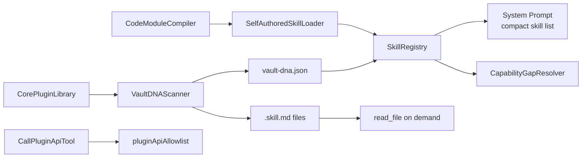

# VaultDNA -- Plugin Discovery & Skill Generation

VaultDNA is Obsilo's automatic plugin discovery system. It scans all installed Obsidian plugins, classifies their capabilities, generates skill files, and makes them available to the agent. This allows the agent to leverage the user's plugin ecosystem without manual configuration.

## Architecture Overview

## VaultDNAScanner

**File:** `src/core/skills/VaultDNAScanner.ts`

Scans both core and community plugins by reading `app.plugins.manifests` (all installed, enabled and disabled). For each plugin:

1. **Command extraction:** Collects all registered commands, filtering out UI-only patterns (`toggle`, `show-`, `focus`, `settings`, `-panel`, `-sidebar`)
2. **Classification:** Categorizes plugins by command count and type (FULL = 3+ meaningful commands, PARTIAL = fewer)
3. **Skill generation:** Creates `.skill.md` files at `.obsidian-agent/plugin-skills/` with YAML frontmatter describing the plugin's capabilities
4. **Persistence:** Writes `vault-dna.json` with the full scan results
5. **Change polling:** Detects plugin enable/disable changes and regenerates skill files

All scanning is local and offline -- no LLM calls, no network requests (ADR-102, ADR-103).

## SkillRegistry

**File:** `src/core/skills/SkillRegistry.ts`

Combines auto-discovered VaultDNA skills with user toggle settings. Only a compact list of active skills goes into the system prompt (ADR-104). Full `.skill.md` content is read on-demand via `read_file` when the agent needs details.

Key method: `getActivePluginSkills()` returns enabled plugins that have not been toggled off by the user via settings.

## CorePluginLibrary

**File:** `src/core/skills/CorePluginLibrary.ts`

Hand-maintained static definitions for Obsidian's 12 agentifiable core plugins. Core plugins have no public GitHub repo and no community registry entry, so static definitions are the most reliable approach (ADR-101).

Each definition includes: `id`, `name`, `classification`, `commands[]`, `description`, and `instructions` -- providing the agent with enough context to use the plugin's commands correctly.

## SelfAuthoredSkillLoader

**File:** `src/core/skills/SelfAuthoredSkillLoader.ts`

Manages agent-created skill files (`.skill.md`) with YAML frontmatter. Skills are stored in the plugin data directory under `skills/` and hot-reload via vault file events.

Skills can optionally contain **code modules** -- TypeScript files in a `code/` subdirectory that are compiled and registered as dynamic tools. This unifies the "Skills" and "Dynamic Tools" concepts into a single abstraction.

Each skill defines: `name`, `description`, `trigger` (regex), `source` (`learned` | `user` | `bundled`), `requiredTools`, and optional `codeModules`.

## CodeModuleCompiler

**File:** `src/core/skills/CodeModuleCompiler.ts`

Compiles TypeScript code modules within skills into executable dynamic tools. The pipeline:

1. **AST validation** via `AstValidator` -- ensures code does not use prohibited patterns
2. **Source wrapping** -- transforms the module into a sandbox-compatible format
3. **Compilation** via `EsbuildWasmManager` -- compiles TypeScript to JavaScript using esbuild WASM
4. **Dry-run testing** -- executes in the sandbox to verify no runtime errors
5. **Registration** -- registers the compiled module as a dynamic tool in the `ToolRegistry`

Each code module defines: `name`, `source_code`, `description`, `input_schema`, `is_write_operation`, and optional `dependencies`.

## CapabilityGapResolver

**File:** `src/core/skills/CapabilityGapResolver.ts`
**Tool:** `ResolveCapabilityGapTool` (`src/core/tools/agent/ResolveCapabilityGapTool.ts`)

A 3-stage resolution system for when the agent encounters an unknown task (ADR-106):

| Stage | Source | Action |
|-------|--------|--------|
| 1 | Active skills | Keyword match against enabled plugins -- returns the matching skill |
| 2 | Disabled plugins | Keyword match against installed but disabled plugins -- suggests enabling |
| 3 | Archived/not found | Checks previously installed plugins, then reports an honest gap |

Implemented as a deterministic TypeScript component (not a prompt instruction) for testable, predictable behavior.

## Plugin API Bridge

**Tool:** `CallPluginApiTool` (`src/core/tools/agent/CallPluginApiTool.ts`)
**Allowlist:** `src/core/tools/agent/pluginApiAllowlist.ts`

Calls JavaScript methods on Plugin instances directly within Obsidian's runtime -- no shell, no process spawn.

### Two-Tier Allowlist

| Tier | Source | Default |
|------|--------|---------|
| Tier 1 | Built-in allowlist (compile-time, curated) | Read/write classified per method |
| Tier 2 | Dynamic discovery (VaultDNA Scanner) | Always classified as write until user override |

### Security Controls

- **Blocked methods:** `execute`, `executeJs`, `render`, `register`, `unregister`, and similar sensitive APIs
- **10-second timeout** per API call
- **Return value sanitization:** Circular references and DOM nodes filtered, output truncated to 50KB
- **Approval:** Read calls and write calls have separate auto-approval toggles in the [governance layer](/dev/governance)

## Related ADRs

| ADR | Topic |
|-----|-------|
| ADR-009 | Local skills architecture |
| ADR-014 | VaultDNA plugin discovery design |
| ADR-101 | Core plugin static definitions |
| ADR-102 | Scan scope (all installed, enabled + disabled) |
| ADR-103 | Skeleton generation without LLM |
| ADR-104 | Compact system prompt skill listing |
| ADR-106 | Deterministic capability gap resolution |
| ADR-108 | Plugin API bridge and allowlist tiers |
